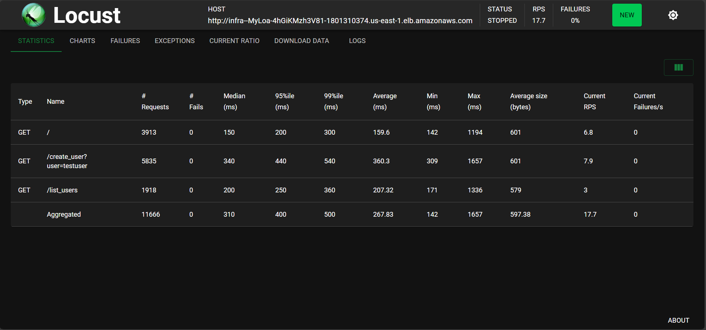

# Documentação do Projeto CloudFormation

### Computação em Nuvem - 6º Semestre Engenharia de Computação - Insper

### Arthur Tamm - Maio/2024
---

## Sumário
1. [Introdução](#1-introdução)
2. [Arquitetura da Solução](#2-arquitetura-da-solução)
3. [Instalação e Configuração](#3-instalação-e-configuração)
4. [Implementação da Infraestrutura](#4-implementação-da-infraestrutura)
5. [Análise de Custos](#5-análise-de-custos)
6. [Análise de Carga](#6-análise-de-carga)
## 1. Introdução
Este projeto implementa uma infraestrutura automatizada usando AWS CloudFormation, que inclui balanceamento de carga com autoscaling, alarmes e uma aplicação básica para testes. Utiliza-se também o AWS CodePipeline para atualizações automáticas baseadas em mudanças no repositório GitHub.

## 2. Arquitetura da Solução
A arquitetura deste projeto é projetada para fornecer uma solução robusta, escalável e altamente disponível usando a AWS CloudFormation, que provisiona e gerencia uma infraestrutura completa na nuvem AWS para uma aplicação web. A arquitetura envolve componentes como VPC, sub-redes, gateway de internet, tabelas do DynamoDB, instâncias EC2 com configuração de auto scaling, grupos de segurança e um balanceador de carga. Além disso, incorpora uma pipeline de CI/CD automatizada usando AWS CodePipeline e AWS CodeBuild, conectada a um repositório GitHub para atualizações contínuas da infraestrutura e da aplicação.

## Componentes da Infraestrutura
### 1. Virtual Private Cloud (VPC):
Uma VPC isolada (`MyVPC`) com um bloco CIDR `10.0.0.0/24` é criada para proporcionar um ambiente de rede controlado onde recursos da AWS podem ser lançados.

### 2. Subnets:
Duas subnets privadas (`PublicSubnetOne` e `PublicSubnetTwo`) são configuradas em zonas de disponibilidade diferentes (us-east-1a e us-east-1b) para garantir alta disponibilidade e tolerância a falhas.

### 3. Internet Gateway e Routing:
Um Internet Gateway (`MyInternetGateway`) é associado à VPC para permitir acesso à internet. Uma tabela de rotas (`MyRouteTable`) e uma rota pública são configuradas para direcionar o tráfego externo através do gateway.

### 4. Security Groups:
Dois grupos de segurança são criados:
  - `LoadBalancerSecurityGroup`: Permite tráfego HTTP de entrada em qualquer lugar para o balanceador de carga.
  - `InstanceSecurityGroup`: Permite tráfego na porta 5050 apenas do balanceador de carga, protegendo as instâncias EC2.

### 5. Elastic Load Balancing (ALB):
Um Application Load Balancer (`MyLoadBalancer`) é configurado para distribuir o tráfego entre as instâncias EC2 dentro das subnets privadas. Um ouvinte (`MyALBListener`) é configurado para encaminhar o tráfego para um grupo de destino (`MyTargetGroup`).

### 6. Auto Scaling Group:
Um grupo de auto scaling (`MyAutoScalingGroup`) gerencia as instâncias EC2, escalando automaticamente a capacidade de acordo com a demanda e garantindo que a aplicação mantenha sua performance e disponibilidade. Este grupo utiliza uma configuração de lançamento (`MyLaunchConfiguration`) que especifica a imagem AMI, o tipo de instância, os grupos de segurança e perfis de IAM necessários para operação das instâncias EC2.

- **Políticas de escalonamento**:
  - **Política de aumento de capacidade (ScaleUpPolicy)**: Aumenta o número de instâncias quando a utilização da CPU excede um limite definido.
  - **Política de redução de capacidade (ScaleDownPolicy)**: Reduz o número de instâncias quando a utilização da CPU é menor que um limite definido.

- **Alarmes de Utilização da CPU**:
    - **Alarme de Alta Utilização de CPU (HighCPUAlarm)**: Dispara a política de aumento de capacidade quando a utilização da CPU excede um limite definido por um período também pré-definido.
    - **Alarme de Baixa Utilização de CPU (LowCPUAlarm)**: Dispara a política de redução de capacidade quando a utilização da CPU é menor que um limite definido por um período também pré-definido.

    Como a aplicação é leve, p
    ara visualizar o comportamento do auto scaling, é possível simular a utilização da CPU das instâncias EC2 com a aplicação de carga usando a ferramenta `Locust`. Essa análise é realizada na seção de [Análise de Carga](#6-análise-de-carga).

- **Launch Configuration**:
    - **MyLaunchConfiguration**: Configuração de lançamento que especifica a imagem AMI, o tipo de instância, os grupos de segurança e perfis de IAM necessários para operação das instâncias EC2. Ela também contém um script de inicialização (`UserData`) que automatiza a instalação de software necessário, configurações de sistema e a execução da aplicação ao iniciar a instância. Esta abordagem garante que todas as instâncias sejam padronizadas e prontas para servir a aplicação imediatamente após o lançamento.

### 7. IAM Roles e Policies:
Papéis IAM (`EC2DynamoDBAccessRole`, `CodeBuildServiceRole`, `CodePipelineServiceRole`) são configurados para permitir que os serviços da AWS assumam funções específicas e acessem recursos como o DynamoDB e o Secrets Manager.

### 8. DynamoDB:
Uma tabela DynamoDB (`MyDynamoDBTable`) é usada para armazenar dados da aplicação, configurada para ser acessada de forma eficiente e segura pelas instâncias EC2.

### 9. AWS CodePipeline e CodeBuild:
Uma pipeline de integração e entrega contínuas é configurada (`MyCodePipeline`) com um projeto de build (`MyCodeBuildProject`) para automatizar o deployment da infraestrutura e da aplicação sempre que mudanças são feitas no repositório do GitHub.

### 10. S3 Bucket:
Um bucket S3 (`PipelineArtifactBucket`) é utilizado para armazenar artefatos entre as fases da pipeline.

## Conectividade e Segurança
- **VPCEndpoint para DynamoDB**: Um VPC Endpoint é configurado para permitir acesso direto e privado ao DynamoDB a partir da VPC sem necessitar de tráfego pela internet pública, aumentando a segurança e reduzindo a latência.

- **Alarmes de Utilização de CPU**: Alarmes do CloudWatch (HighCPUAlarm, LowCPUAlarm) são configurados para monitorar a utilização da CPU e escalar as instâncias EC2 automaticamente, ajudando a manter o equilíbrio entre custo e performance.

## Integração e Delivery Contínuos
- A infraestrutura de CI/CD permite uma integração contínua das mudanças no código e na infraestrutura, promovendo um ciclo de vida de desenvolvimento ágil e a entrega rápida de melhorias e novas funcionalidades para a aplicação.

Esta arquitetura detalhada proporciona uma base sólida para a aplicação, suportando escalabilidade, segurança e alta disponibilidade, essenciais para operações críticas e de grande volume na AWS.

## 3. Instalação e Configuração

Para rodar os scripts de criação e deleção da infraestrutura é necessário utilizar um terminal WSL ou distribuições Linux padrão, como Ubuntu.

### 1. Dependências
Para rodar os scripts que gerenciam a infraestrutura, é necessário instalar as seguintes dependências:
- AWS CLI
- GitHub CLI
- xdg-utils (Ubuntu) ou wslu (Windows)
- jq
- locust

Para garantir que todas as dependências estejam instaladas, execute o script `requirements.sh` no terminal.

### 2. Configurando o AWS CLI
Configure suas credenciais e região padrão:
```
aws configure
```
Você precisará inserir:

- AWS Access Key ID
- AWS Secret Access Key
- Default region name (utilizaremos us-east-1)
- Default output format (pode deixar em branco)

### 3. Configurando o GitHub CLI
Autentifique-se no Github via CLI usando

```
gh auth login
```
Siga as instruções na tela para autenticar, escolhendo HTTPS como método de conexão e autenticando através de um token.

O token utilizado para se autenticar precisará ter os seguinte escopos:
- repo
- workflow
- read:org
- user
- delete_repo

Se já tiver um token, é possível atualizar os escopos. Caso contrário, será necessário criar um token https://github.com/settings/tokens

### 5. Configuração Geral do Git
Configure seu usuário e email para o Git, se ainda não tiver feito:
```
git config --global user.name "Seu Nome"
git config --global user.email "seuemail@exemplo.com"
```

### 7. Permissões AWS
Para implementar a infraestrutura proposta, é necessário adicionar permissões a sua conta AWS.

#### Permissões IAM necessárias:
- AmazonDynamoDBFullAccess
- AmazonEC2FullAccess
- AmazonS3FullAccess
- AWSCloudFormationFullAccess
- AWSCodeBuildAdminAccess
- AWSCodeCommitFullAccess
- AWSCodePipeline_FullAccess
- IAMFullAccess
- SecretsManagerReadWrite

### 8. Criando AWS Secret Manager
Para criar um segredo no AWS Secrets Manager que contém um usuário e um token, você pode seguir os seguintes passos. Isso é útil para armazenar de forma segura informações sensíveis, como credenciais de API ou tokens de acesso, que seu aplicativo ou scripts precisam acessar.

Rode o comando:
```
aws secretsmanager create-secret --name github-access-token --description "GitHub Access Token for CI/CD" --secret-string '{"username":"myusername","token":"mytoken"}'
```
Substitua "myusername" pelo seu nome de usuário do GitHub e "mytoken" pelo seu token de acesso.

## 4. Implementação da Infraestrutura

Esta seção descreve o processo para iniciar a infraestrutura utilizando o script `deploy.sh`. Este script automatiza o deployment de uma stack CloudFormation, que inclui configurações de pipeline e infraestrutura baseada na nuvem.

### Pré-requisitos

Antes de executar o script, certifique-se de que as seguintes condições sejam atendidas:

- AWS CLI e GitHub CLI estão instalados e configurados.
- Credenciais de acesso para AWS e GitHub estão configuradas.
- Você tem permissões adequadas na AWS para criar e gerenciar recursos CloudFormation, IAM, EC2, etc.
- O arquivo `project.yaml` deve estar disponível no diretório ou um nível acima do script.

### Passos para Execução

1. **Definição do Secret Name**: O script espera um nome de segredo `github-access-token` que deve ser previamente configurado no AWS Secrets Manager.

2. **Obtenção da Identidade Git**: O script usa a GitHub CLI para obter o nome de usuário e email do Git configurados na sua máquina. Certifique-se de que esses dados estejam corretamente configurados para evitar falhas.

3. **Criação e Configuração do Repositório GitHub**: Se o repositório especificado não existir, ele será criado e clonado. Caso contrário, o script garante que o repositório local esteja sincronizado com o GitHub.

4. **Adição do Arquivo de Projeto**: O script verifica a existência do `project.yaml` e o adiciona ao repositório Git, se encontrado.

5. **Deployment da Stack CloudFormation**: Utilizando o AWS CLI, o script faz o deploy da stack `pipeline-stack` com base no arquivo `pipeline.yaml`. Se o arquivo não estiver no caminho especificado, o script falhará.

6. **Monitoramento do Pipeline**: O script aguarda até que a execução do pipeline seja concluída, lidando com possíveis estados de execução como sucesso, falha, ou parada.

7. **Deployment da Infraestrutura**: Após o sucesso do pipeline, a stack da infraestrutura é deployada.

8. **Acesso à Aplicação**: No final do script, a URL da aplicação é exibida e aberta automaticamente no navegador padrão do sistema operacional.

### Executando o Script

Para iniciar o deployment, navegue até o diretório do script e execute o comando:

```
./deploy.sh
```

## 5. Análise de Custos
A análise de custos da rede foi realizada na calculadora de custos da AWS e pode ser conferida no arquivo `Cost-Analysis-AWSPricingCalculator.pdf`. Os custos são estimados com base na região us-east-1 e podem variar de acordo com a utilização e a região escolhida. A estimativa mensal foi de USD$52.61 por mês. Entretanto, a aba "Billing" indica uma estimativa mensal de USD$45. Isso é esperado, uma vez que a análise de custos foi realizada pensando na aplicação em uso constante, enquanto a aba "Billing" considera o uso na etapa de desenvolvimento e testes, que é menor.

Além disso, alguns parâmetros foram superestimados por questões de segurança e escalabilidade, como o tamanho do item armazenado e a capacidade de leitura e gravação do DynamoDB.

### Principais Custos e Otimizações
Os principais custos associados a esta infraestrutura foram o `Elastic Load Balancing` e o `Amazon Dynamo DB`.

Uma otimização de custos realizada foi a utilização do DynamoDB com o modo `On-Demand`, que cobra apenas pelo uso real, sem taxas fixas. Isso é mais econômico do que o modo `Provisioned`, que cobra uma taxa fixa por capacidade de leitura e gravação, mesmo que não seja totalmente utilizada. Com essa alteração, o custo mensal do DynamoDB foi reduzido de USD$27 para USD$21, e o custo inicial reduziu de USD$180 para USD$0.

Como a aplicação utilizada não requer alto uso de memória, é possível utilizar o free tier do `DynamoDB` que provê 25 GB de armazenamento e 25 unidades de capacidade de gravação e leitura gratuitamente, o que é suficiente para suportar 200 milhões de requests por mês.

Quanto ao `Elastic Load Balancing`, é difícil otimizar ainda mais os custos, visto que as configurações utilizadas foram próximas das mínimas.

## 6. Análise de Carga

A análise de carga foi realizada utilizando a ferramenta `Locust`, que é uma ferramenta de teste de carga de código aberto. O teste foi realizado com 100 usuários virtuais, que acessaram a aplicação em intervalos aleatórios entre 1 e 10 segundos. O teste foi executado por 12 minutos e os resultados podem ser conferidos na imagem abaixo.



Ao todo foram mais de 11.000 requisições com tempo de resposta médio de 267ms e 0 de falhas, o que indica que a aplicação foi capaz de lidar com a carga de forma eficiente e sem erros.

Para executar o teste de carga, basta rodar o script `locust.sh` no terminal. O script irá iniciar o `Locust` e abrirá automaticamente o navegador padrão para acessar a interface de controle do teste.:

```
./locust.sh
```
Este teste decarga permite visualizar o comportamento do auto scaling, que aumenta ou diminui o número de instâncias EC2 de acordo com a demanda, garantindo que a aplicação mantenha sua performance e disponibilidade.